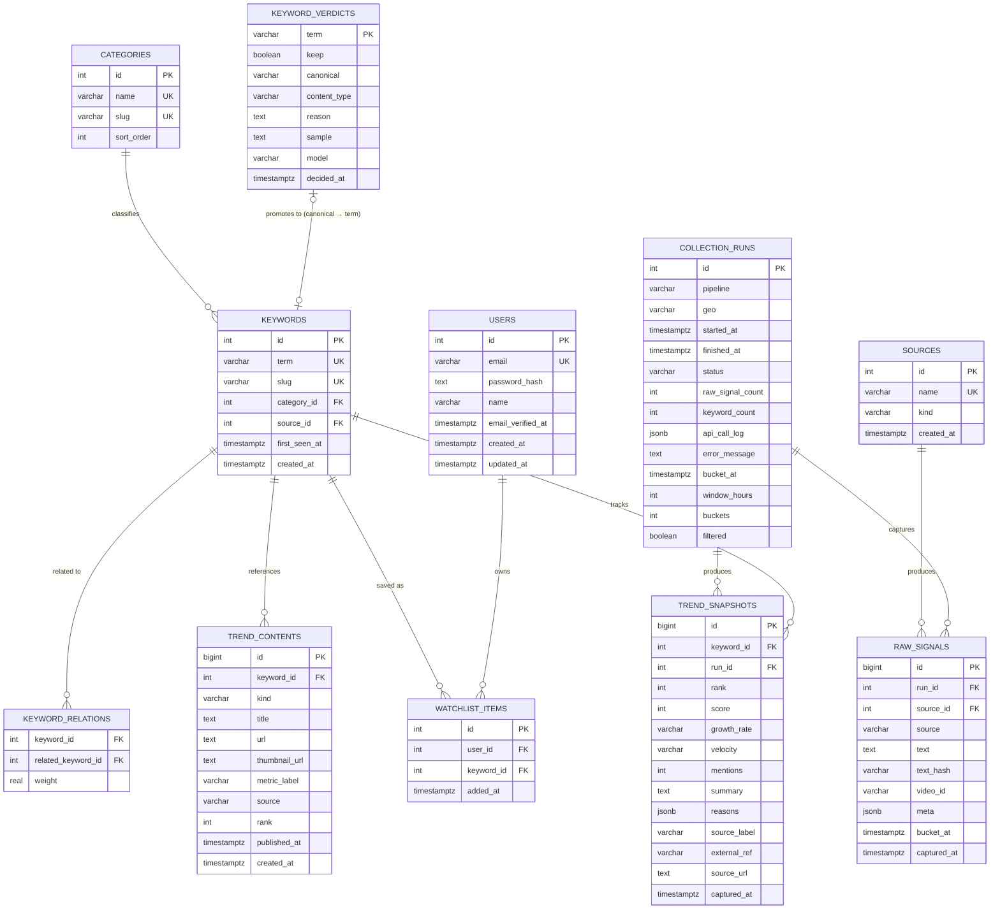

# TrendDrop 페이지별 분석 및 스키마·백엔드 설계

> 이 문서는 `localhost:3000`에서 확인 가능한 모든 라우트를 코드 기준으로 분석하고,
> 현재 두 갈래로 나뉜 파이프라인(`sources/keywords/...` vs `vhe_*`)과 mock 데이터 레이어를
> 하나의 스키마·API로 통합하기 위한 설계안을 정리합니다.

---

## 1. 개요

- **스택**: Next.js 16(App Router) · React 19 · Drizzle ORM · PostgreSQL(Neon) · `postgres` 드라이버
- **인증**: 없음. 관리자 수집 API는 `CRON_SECRET`(선택) 헤더 검증만 `pipeline-v-he`에 존재하고, 나머지 admin API는 무방비 상태
- **데이터 소스 현황**: 실서비스 화면 대부분이 아직 **하드코딩 mock 데이터**(`lib/trend-data.ts`, `lib/trend-timeline.ts`)를 쓰고, DB를 직접 연동한 화면은 소수에 그침
- **DB 스키마 2벌 공존**: `db/schema.ts`(master, `sources/keywords/trend_snapshots/trend_contents`)와 `lib/pipeline-v-he/schema.ts`(실험용, `vhe_` 접두사, `collection_runs`/`raw_signals` 개념 추가)가 서로 독립적으로 존재 — 주석에도 "결과 비교 후 채택 안 되면 vhe\_ 테이블만 지우면 된다"고 명시되어 있어 **의도적으로 임시 병행 중**

---

## 2. 페이지별 분석

### 2.1 `/` — 홈 (실시간 랭킹)

- 구성 파일: [app/page.tsx](app/page.tsx), [app/ranking-board.tsx](app/ranking-board.tsx), [components/collection-controls.tsx](components/collection-controls.tsx)
- **데이터 소스**: `lib/trend-data.ts`(하드코딩 20개 키워드)와 `lib/trend-timeline.ts`(고정 시드 PRNG로 만든 12개 스냅샷 시계열) — **DB를 전혀 조회하지 않음**
- 기능: 실시간/24시간 탭 전환, 카테고리 필터, LIVE 자동 갱신(8초 간격으로 mock 스냅샷 인덱스만 증가), 타임머신 스크러버·재생, 풀투리프레시, 미니 스파크라인, 순위 변동 FLIP 애니메이션
- `CollectionControls`가 `POST /api/admin/collect/pipeline`을 호출해 실제로 DB에 저장은 하지만, **저장된 결과를 홈 화면이 읽어서 반영하지 않음** — 버튼을 눌러도 화면은 그대로(`window.location.reload()`만 하고 서버 데이터는 안 바뀜)
- 각 랭킹 행의 링크가 `href="/trend"`로 **키워드와 무관하게 항상 동일한 페이지로 이동** — 상세 페이지가 파라미터화되어 있지 않음
- 워치리스트 섹션도 `watchItems` 정적 배열 — 사용자별 저장 기능 없음

### 2.2 `/explore` — 탐색

- 구성 파일: [app/explore/page.tsx](app/explore/page.tsx), [app/explore-view.tsx](app/explore-view.tsx), `lib/trend-timeline.ts`
- 카테고리 × 시간 히트맵(12개 시점), 키워드 A/B 순위 궤적 비교(SVG)
- **완전히 결정론적 mock**: `SEED = 20260715` 고정 PRNG로 서버/클라이언트 하이드레이션 불일치를 피하는 구조 — 실제 DB 시계열이 아니라 "그럴듯해 보이는" 합성 데이터
- 히트맵 행 클릭 시 `sessionStorage`에 카테고리를 저장하고 홈으로 이동해 필터를 적용하는 방식(새 라우팅 메커니즘 대신 기존 것 재사용) — UX적으로는 합리적인 선택
- **DB에는 이 화면이 요구하는 "다수 시점의 키워드별 랭크 이력"을 조회할 방법이 없음** — `trend_snapshots`가 수집 실행 시점마다 1행씩만 쌓이고 촘촘한 시계열이 없음

### 2.3 `/trend` — 트렌드 상세

- 구성 파일: [app/trend/page.tsx](app/trend/page.tsx)
- **단일 키워드("제로슈가 아이스티")가 파일에 하드코딩**되어 있고 라우트 파라미터가 없음(`/trend/[slug]`가 아니라 정적 `/trend`)
- 스파크라인, AI 요약(왜 뜨나 + 근거), 관련 콘텐츠 카드, 연관 키워드 칩, 감지 채널 목록 UI는 완성도가 높지만 **백엔드 연동 지점이 전무**
- 홈에서 어떤 키워드를 클릭해도 이 화면 하나로만 연결되는 것이 가장 눈에 띄는 구조적 공백

### 2.4 `/api-lab` — API 테스트 콘솔

- 구성 파일: [app/api-lab/page.tsx](app/api-lab/page.tsx), [components/api-test-console.tsx](components/api-test-console.tsx)
- YouTube 수집, Google News 미리보기/저장, DB 상태 확인, DB 테이블 생성, 저장된 트렌드 조회를 버튼으로 실행하는 **개발자용 콘솔**
- 인증 없이 `/api-lab` 경로로 누구나 접근 가능 — 프로덕션에 그대로 배포하면 DB 쓰기(`db:setup`, 각종 `collect`)를 외부에서 트리거할 수 있는 위험

### 2.5 `/docs`, `/docs/[slug]` — 기획 문서 뷰어

- 구성 파일: [app/docs/page.tsx](app/docs/page.tsx), [app/docs/\[slug\]/page.tsx](app/docs/[slug]/page.tsx), [lib/docs.ts](lib/docs.ts)
- `docs/*.md`를 `react-markdown`으로 렌더링. 목록은 `lib/docs.ts`에 **수동으로 하드코딩된 배열**이라 새 문서를 추가해도 이 배열에 등록하지 않으면 `/docs`에 노출되지 않음(이 문서도 마찬가지)

### 2.6 공통 — `AppNav`/커맨드 팔레트

- [app/app-nav.tsx](app/app-nav.tsx): 실제 존재하는 라우트만 연결(랭킹/탐색/트렌드/랩/문서) — 죽은 링크 없음
- 커맨드 팔레트(`⌘K`)는 카테고리 이동 이벤트를 브로드캐스트하는 방식으로 홈의 필터와 연동

---

## 3. 현재 백엔드 구조 요약

### 3.1 API 라우트 목록

| 라우트                             | 메서드   | 역할                                                | 인증                        |
| ---------------------------------- | -------- | --------------------------------------------------- | --------------------------- |
| `/api/trends`                      | GET      | `getTrendFeed()` — DB 있으면 조회, 없으면 mock 반환 | 없음                        |
| `/api/admin/collect/pipeline`      | POST     | master 파이프라인 실행(Google Trends→YouTube+News)  | 없음                        |
| `/api/admin/collect/pipeline-v-he` | GET/POST | v-he 파이프라인 실행 + 최신 결과 조회               | POST만 `CRON_SECRET` 선택적 |
| `/api/admin/collect/youtube`       | POST     | YouTube seed 키워드 수집                            | 없음                        |
| `/api/admin/collect/google-news`   | POST     | Google News RSS 수집·저장                           | 없음                        |
| `/api/google-news/preview`         | GET      | Google News RSS 미리보기(저장 안 함)                | 없음                        |
| `/api/admin/db/setup`              | POST     | 테이블 생성(`ensureDatabaseTables`)                 | 없음                        |
| `/api/admin/bootstrap`             | POST     | mock 데이터를 DB에 시딩                             | 없음                        |
| `/api/db/status`                   | GET      | DB/YouTube 키 설정 여부 확인                        | 없음                        |
| `/api/docs`                        | GET      | 문서 목록 JSON                                      | 없음                        |

### 3.2 스키마 이원화 문제

`db/schema.ts`(master)와 `lib/pipeline-v-he/schema.ts`(vhe)는 **거의 동일한 테이블을 접두사만 다르게 중복 정의**하고 있고, vhe 쪽에만 존재하는 개념(`collection_runs`, `raw_signals`, `run_id`로 스냅샷 묶기)이 더 뛰어난 설계입니다:

- master: `sources → keywords → trend_snapshots / trend_contents` (실행 단위 개념 없음, 매 수집이 그냥 새 `trend_snapshots` row)
- vhe: 위 구조 + `vhe_collection_runs`(실행 메타데이터·API 호출 로그) + `vhe_raw_signals`(토큰화 이전 원문, dedup 해시로 재수집 시 중복 방지) + `trend_snapshots.rank`/`run_id` 컬럼 추가

즉 vhe 스키마가 사실상 master의 상위 호환입니다. 아래 6장의 통합 스키마는 **vhe 쪽 설계를 기준으로 병합**합니다.

---

## 4. 발견된 핵심 공백 (설계에 반영한 이유)

1. **키워드 상세 페이지 라우팅 불가** — `keywords`에 사람이 읽고 URL로 쓸 수 있는 식별자(`slug`)가 없어 `/trend/[id]`를 만들어도 링크가 부자연스러움
2. **카테고리가 자유 텍스트 문자열** — `categoryFor()` 정규식 휴리스틱으로 매번 추론, 오타/중복 카테고리 생성 가능, 마스터 목록이 없어 UI 필터가 "현재 존재하는 값"에만 의존
3. **촘촘한 시계열 부재** — `/explore`·홈의 스파크라인이 요구하는 "짧은 간격 다회 스냅샷"을 저장할 스케줄러/보존 정책이 없음(현재는 사람이 버튼을 누를 때만 1행 추가)
4. **워치리스트 영속성 없음, 게다가 저장 UI가 두 갈래** — 사용자 계정 개념이 없어 저장 기능이 정적 배열(`watchItems`)일 뿐 아니라, PR #26 이후 랭킹 행에 `localStorage` 기반 "관심 키워드 즐겨찾기 ★"가 별도로 추가되어 같은 목적의 저장 기능이 두 곳에 나뉘어 있음. 백엔드 연동 시 하나의 `watchlist_items`로 합쳐야 함(6.2 참고)
5. **관리자 API 무방비** — `pipeline-v-he` 외 나머지 admin/collect·db/setup·bootstrap 엔드포인트에 인증이 전혀 없어 `/api-lab`이 배포되면 외부에서 DB 쓰기 유발 가능
6. **콘텐츠에 썸네일 없음** — `trend_contents`에 `thumbnail_url`이 없어 상세 페이지의 "관련 콘텐츠" 카드가 플랫폼 이니셜만 표시
7. **재실행 시 중복/폭주 방지 부재** — master 파이프라인은 idempotency나 실행 잠금이 없어 버튼 연타 시 동일 키워드에 대해 `trend_contents`가 계속 append됨
8. **실시간 하이라이트 티커 데이터 모델 부재** — 홈 화면의 "신규/급상승 키워드" 배너(`getTickerItems()`)가 요구하는 "이번 시점에 새로 진입했는지·급등했는지 + 등락폭" 판정 로직이 스키마·API 어디에도 없음
9. **실시간 갱신 전략 부재** — 클라이언트가 새 `collection_runs`가 생겼다는 걸 알아낼 방법이 정의되어 있지 않음. LIVE 토글의 실제 데이터 갱신, 그리고 수집 버튼을 눌러도 화면에 반영되지 않는 문제(2.1 참고)가 모두 이 부재에서 비롯됨

---

## 5. 화면별 필요 데이터 정의

스키마를 설계하기 전에, 각 화면의 UI 요소가 실제로 어떤 데이터 필드를 요구하는지 먼저 매핑합니다. "현재 출처" 열은 지금 어디서 값을 가져오는지(대부분 mock), "대응 스키마" 열은 6장 통합 스키마의 어느 테이블·컬럼이 이를 충족하는지를 가리킵니다.

### 5.1 `/` 홈 — 실시간 랭킹

| UI 요소                                  | 필요 필드                                                          | 현재 출처                                    | 대응 스키마                                                                                                                  |
| ---------------------------------------- | ------------------------------------------------------------------ | -------------------------------------------- | ---------------------------------------------------------------------------------------------------------------------------- |
| 랭킹 행                                  | keyword, category, rank, previousRank, growth, spark(최근 7포인트) | `lib/trend-data.ts` 하드코딩 배열            | `keywords.term`, `keywords.category_id`, 최근 두 `trend_snapshots.rank`(등락 계산), 최근 N개 `trend_snapshots.score`(스파크) |
| 실시간/24시간 탭                         | 기간별로 다른 정렬·등락 기준                                       | `realtimeTrends` vs `dailyTrends` 별도 배열  | 동일 데이터를 집계 윈도우만 다르게(`period=realtime`→최신 run, `period=daily`→24시간 내 run 집계)                            |
| LIVE 스냅샷 전환                         | 다수 시점의 keyword별 rank 목록                                    | `trend-timeline.ts`의 PRNG 생성 12스냅샷     | 동일 keyword에 대해 여러 `run_id`에 걸친 `trend_snapshots` 행                                                                |
| 카테고리 탭                              | 카테고리 이름 목록 + 표시 순서                                     | `trend-data.ts`에서 파생한 `Set`             | `categories.name`, `categories.sort_order`                                                                                   |
| 요약 통계(추적 수/신규 진입/최고 상승률) | 화면에 보이는 행들의 집계값                                        | 클라이언트에서 계산                          | 필드만 있으면 프론트 집계 유지 가능 — 별도 컬럼 불필요                                                                       |
| 워치리스트 카드                          | keyword, meta 설명, score                                          | `watchItems` 정적 배열                       | `watchlist_items ⋈ keywords ⋈ trend_snapshots`(최신 score)                                                                   |
| 관심 키워드 즐겨찾기(★, 랭킹 행)         | keyword                                                             | `localStorage`(`td-saved-keywords`)          | 위 워치리스트 카드와 **같은 `watchlist_items` 테이블로 통합** — 로그인 붙기 전까지는 `localStorage` 유지가 맞고, 붙는 시점에 두 UI를 하나의 저장 목록으로 합쳐야 함                |
| 수집 버튼 결과 메시지                    | 수집된 키워드 개수                                                 | `POST /api/admin/collect/pipeline` 응답 JSON | `collection_runs.keyword_count`                                                                                              |
| 실시간 하이라이트 티커                   | keyword, kind(new/surge), delta                                    | `getTickerItems()`(트렌드 타임라인 mock)     | 별도 테이블 불필요 — 최근 두 `run_id`의 `trend_snapshots.rank`를 비교해 신규 진입/급등을 판정하는 쿼리(6.3 참고)              |

### 5.2 `/explore` 탐색

| UI 요소         | 필요 필드                                          | 현재 출처                     | 대응 스키마                                                                                            |
| --------------- | -------------------------------------------------- | ----------------------------- | ------------------------------------------------------------------------------------------------------ |
| 히트맵 열(시점) | 시점 라벨(clock), 최신 여부                        | `snapshots` mock 배열         | `collection_runs.started_at`(라벨 포맷은 프론트에서 처리)                                              |
| 히트맵 셀       | category, run_id 조합의 heat(0~100)                | `getCategoryHeat()` 계산 로직 | `trend_snapshots`를 `run_id` + `category_id`로 그룹핑해 평균/합산 점수를 0~100 정규화                  |
| A/B 비교 선택지 | 최신 시점 키워드 목록(최대 20) + rank              | `latestSnapshot.items`        | 최신 `run_id`의 `trend_snapshots` 상위 20                                                              |
| A/B 궤적 차트   | 키워드별 (시점, rank) 시계열, null 허용(이탈 구간) | `getSeriesForKeyword()`       | `trend_snapshots` where `keyword_id`=X, `run_id` 순 정렬 — 특정 run에 해당 키워드가 없으면 null로 처리 |

### 5.3 `/trend` 상세

| UI 요소              | 필요 필드                                                             | 현재 출처                     | 대응 스키마                                                                                                                                                                              |
| -------------------- | --------------------------------------------------------------------- | ----------------------------- | ---------------------------------------------------------------------------------------------------------------------------------------------------------------------------------------- |
| 히어로/핵심 지표     | keyword, category, growth, velocity, score, detectedAgo               | `trend.ts` 하드코딩 단일 객체 | `keywords`, 해당 키워드 최신 `trend_snapshots` 행                                                                                                                                        |
| 상승 추이 스파크라인 | 최근 7개 시점의 score, 요일/시점 라벨                                 | 하드코딩 배열                 | 최근 N개 `trend_snapshots.score`(`captured_at` 순)                                                                                                                                       |
| AI 요약 · 왜 뜨나    | summary, reasons: [{source, text}] 배열                               | 하드코딩                      | `trend_snapshots.summary`/`reason`은 있으나 **소스별로 분리된 근거 배열은 현재 스키마에 없음** — `reason`을 구조화(jsonb) 하거나 `raw_signals` 상위 N건을 근거로 노출하는 별도 조합 필요 |
| 관련 콘텐츠 카드     | platform, title, metric(예: "저장 12.4K"), kind(릴스/쇼츠 등), 썸네일 | 하드코딩                      | `trend_contents.kind/title/url/source/thumbnail_url`(신설) — **metric(참여 지표 수치)은 현재 어떤 스키마에도 없어 컬럼 추가 필요**                                                       |
| 연관 키워드 칩       | 키워드 문자열 목록(6개)                                               | 하드코딩                      | `keyword_relations`(신설, co-occurrence 가중치 기준 상위 N개)                                                                                                                            |
| 감지 채널 목록       | 채널/소스 이름 목록                                                   | 하드코딩                      | 해당 키워드의 `trend_snapshots.source_label` 또는 관련 `trend_contents.source`의 distinct 값                                                                                             |

### 5.4 `/api-lab`

개발자 콘솔이라 "화면이 요구하는 데이터"보다는 "호출 가능한 액션 목록"에 가깝습니다. 각 버튼이 호출하는 엔드포인트는 3.1의 API 라우트 표로 이미 커버되므로 별도 데이터 요구사항표는 생략합니다.

이 표에서 두 가지가 특히 6장 스키마 설계에 직접 반영됐습니다: **`/trend` 상세의 `metric`(콘텐츠별 참여 지표)이 어떤 기존 스키마에도 없다는 점**, **AI 요약 근거(reasons)가 구조화되어 있지 않다는 점** — 이 둘은 6.2 변경점 표에 컬럼 추가로 반영했습니다.

---

## 6. 통합 스키마 설계

### 6.1 ERD

### 6.2 기존 스키마 대비 변경점

| 변경                                                                                | 사유                                                                                                                                      |
| ----------------------------------------------------------------------------------- | ----------------------------------------------------------------------------------------------------------------------------------------- |
| `keywords.slug` (UK) 추가                                                           | `/trend/[slug]` 라우팅을 가능하게 함(예: `제로슈가-아이스티` → `zero-sugar-ice-tea` 또는 한글 슬러그 + id 접미사)                         |
| `categories` 테이블 신설, `keywords.category_id` FK로 전환                          | 자유 텍스트 → 마스터 목록. `sort_order`로 UI 탭 순서 고정, 필터 UI가 "존재하는 값"이 아니라 "정의된 값"을 기준으로 렌더                   |
| `collection_runs`를 마스터 개념으로 승격(vhe 전용 → 공통), `pipeline` 컬럼으로 구분 | master/vhe 파이프라인이 같은 실행 로그·API 호출 기록 구조를 공유하도록                                                                   |
| `raw_signals`도 공통화                                                              | 재수집 시 텍스트 해시 dedup은 모든 파이프라인에 유용한 기능이라 master 전용 제외할 이유 없음                                              |
| `trend_snapshots.run_id`, `rank` 추가                                               | run 단위로 "이 실행에서의 순위"를 남겨야 `/explore` 히트맵·A/B 비교가 실제 데이터로 그려짐(5.2 참고). (`source_id`는 검토 중 제외 — 한 키워드가 여러 소스에서 동시에 잡힐 수 있어 단일 FK로 못 담고, `reasons`/`source_label`이 이미 그 정보를 표현함) |
| `trend_snapshots.reason`(text) → `reasons`(jsonb)                                   | `/trend` 상세의 "AI 요약 · 왜 뜨나" 섹션이 `{source, text}` 배열을 요구(5.3 참고) — 단일 텍스트로는 소스별 근거를 분리해 렌더링할 수 없음 |
| `trend_contents.thumbnail_url`, `metric_label` 추가                                 | 상세 페이지 "관련 콘텐츠" 카드가 썸네일과 참여 지표 문자열(예: "저장 12.4K")을 요구하는데 기존 컬럼에 없던 필드(5.3 참고)                 |
| `keyword_relations` 신설                                                            | 상세 페이지 "연관 키워드" 칩을 mock 배열이 아니라 co-occurrence 점수 기반으로 생성                                                        |
| `users`, `watchlist_items` 신설                                                     | 워치리스트를 실제 저장 기능으로 만들려면 최소한의 계정 개념 필요(익명 디바이스 토큰으로 시작해도 무방). 또한 현재 두 갈래인 저장 UI(워치리스트 패널의 `watchItems`, 랭킹 행의 `localStorage` 즐겨찾기 ★)를 이 테이블 하나로 합치는 마이그레이션이 함께 필요               |
| `varchar(500)` → `text` (url류)                                                     | 유튜브/뉴스 URL에 트래킹 파라미터가 붙으면 500자를 넘는 경우가 실제로 있음                                                                |
| PK를 `bigint`로(스냅샷/콘텐츠/신호)                                                 | 시계열 수집을 촘촘하게(예: 시간당) 돌리면 `integer` 범위를 오래 못 감                                                                     |
| `collection_runs.bucket_at`/`window_hours`/`buckets`/`filtered` 추가                | `trend-rising` 파이프라인(PR #23)에서 검증된 필드. 실행이 참조한 데이터 기준 시각·집계 창 길이·창 내 실제 버킷 수·LLM 필터 적용 여부를 남겨야 수집 누락 감지·결과 재현이 가능      |
| `raw_signals.source_id`(FK → sources) 추가                                          | 기존 `source`(신호 종류)만으로는 다중 커뮤니티 소스가 늘어날 때 "어느 사이트"인지 구분 불가. 이미 그려진 `SOURCES ||--o{ RAW_SIGNALS` 관계를 실제 컬럼으로 채움 |
| `raw_signals.bucket_at` 추가                                                        | 수집이 귀속되는 1시간 버킷. 중복 제거(`UNIQUE(source_id, text_hash, bucket_at)`)와 체류시간 기반 가중치 계산에 필요                       |
| `trend_snapshots.mentions` 추가                                                     | `growth_rate` 같은 표시용 문자열의 근거가 되는 원시 언급 횟수(raw count) — 표시값만 있고 원인 수치가 없던 문제 보완                       |
| `trend_snapshots.reasons`(jsonb) 항목에 `sample`/`weight` 추가                       | `sample`(근거 원문 인용)·`weight`(소스별 기여 점수)를 붙여 "왜 떴는지"를 재구성 없이 바로 보여줄 수 있게 함                              |
| `keyword_verdicts` 테이블 신설                                                      | 토크나이저가 훼손한 단어 복원(`오디세`→`오디세이`), 노이즈 필터링(`같아서`, `대한` 등)을 LLM이 판정하고 캐싱하는 계층. `keep=true`인 term만 `keywords`로 승격 |

### 6.3 스키마 변경 없이 쿼리로 해결되는 것들

모든 화면 요구사항이 새 컬럼을 필요로 하지는 않습니다. **실시간 하이라이트 티커**(4장 8번 공백)가 대표적인 예입니다: 최근 두 `run_id`의 `trend_snapshots`를 `keyword_id` 기준으로 비교해, 직전 run에 없던 키워드는 `kind: new`, 있었지만 `rank`가 일정 폭 이상 오른 키워드는 `kind: surge`(그때의 순위 차이를 `delta`로) 판정하면 됩니다. 이 값은 저장할 필요 없이 `GET /api/trends` 응답을 만들 때 매번 계산해서 내려주면 충분합니다(7.1의 `meta.ticker` 참고).

---

## 7. 백엔드 API 설계

현재 페이지가 DB를 직접 조회하는 방식과 API를 fetch하는 방식이 혼재되어 있는데, **API를 거치는 방식으로 통일**하는 것을 전제로 설계합니다(캐싱·재사용·향후 모바일 클라이언트 확장에 유리).

### 7.1 공개 API (홈/탐색/상세 화면용)

| 엔드포인트                                                                 | 설명                                                          | 대체하는 화면                                                                           |
| -------------------------------------------------------------------------- | ------------------------------------------------------------- | --------------------------------------------------------------------------------------- | --------------------------------------------- |
| `GET /api/categories`                                                      | 카테고리 마스터 목록(정렬 포함)                               | 홈 카테고리 탭, 탐색 히트맵 행 순서                                                     |
| `GET /api/trends?period=realtime                                           | daily&category=&limit=`                                       | 최신 run 기준 랭킹 + `previousRank`(직전 run 대비 등락) + `spark`(최근 N회 run의 score) + `meta.runId`, `meta.ticker`(신규/급상승 키워드 목록, 6.3 참고) | 홈 `RankingBoard` — mock `trend-data.ts`/`trend-timeline.ts` 대체 |
| `GET /api/keywords/:slug`                                                  | 키워드 상세: 최신 스냅샷, 콘텐츠 목록, 연관 키워드, 감지 채널 | `/trend/[slug]` — mock `trend.ts` 대체                                                  |
| `GET /api/keywords/:slug/history?window=12h`                               | 해당 키워드의 run별 rank/score 시계열                         | `/trend` 스파크라인, `/explore` A/B 비교                                                |
| `GET /api/explore/heatmap?window=12h`                                      | run × category 집계 heat 매트릭스                             | `/explore` 히트맵 — `trend-timeline.ts` PRNG 대체                                       |
| `GET /api/watchlist` / `POST /api/watchlist` / `DELETE /api/watchlist/:id` | 워치리스트 CRUD(초기엔 익명 세션 쿠키 기준)                   | 홈 워치리스트 섹션                                                                      |

### 7.2 관리자/수집 API (통합)

| 엔드포인트                                              | 설명                                                                                                                                                                   |
| ------------------------------------------------------- | ---------------------------------------------------------------------------------------------------------------------------------------------------------------------- |
| `POST /api/admin/collect/:pipeline`                     | `pipeline` = `master`\|`v-he`\|(향후 `naver`, `x` 등). 모든 admin 라우트에 `Authorization: Bearer $CRON_SECRET` 필수화(현재 v-he만 선택적으로 적용된 것을 전체로 확장) |
| `GET /api/admin/collect/runs?pipeline=&limit=`          | 파이프라인 무관 공통 실행 로그 조회                                                                                                                                    |
| `GET /api/admin/collect/runs/:id/signals`               | 특정 run의 원문 신호 조회(현재 `npm run report:v-he` CLI로만 가능한 것을 API화)                                                                                        |
| `POST /api/admin/db/setup`, `POST /api/admin/bootstrap` | 기존 유지하되 `CRON_SECRET` 또는 별도 admin 토큰 필수화, `/api-lab` 페이지 자체도 프로덕션 빌드에서 제외하거나 동일 토큰 게이트 적용                                   |

### 7.3 인증 최소안

정식 로그인 붙이기 전 단계에서도 다음 두 가지는 바로 적용 권장:

- **admin 계열 전체**에 `isAuthorized()`(현재 v-he 라우트에만 있는 함수)를 공통 미들웨어로 추출해 적용
- `/api-lab` 페이지는 `middleware.ts`에서 프로덕션 환경 + 관리자 쿠키/헤더 체크로 감싸기(현재는 URL만 알면 누구나 접근)

### 7.4 실시간 갱신 전략

홈의 LIVE 토글이 실제로 뭘 해야 하는지, 그리고 "수집 버튼은 동작하는데 화면에 안 보인다"(4장 9번 공백)는 문제가 사실 같은 원인에서 나옵니다 — 클라이언트가 새 `collection_runs`가 생겼는지 알아낼 방법이 없다는 것.

- **폴링(1차 권장)**: LIVE가 켜져 있는 동안 클라이언트가 `GET /api/trends`를 15~30초 간격으로 재요청하고, 응답의 `meta.runId`가 이전과 같으면 리렌더 없이 넘어감. 실제 수집 주기(예: 1시간)보다 훨씬 잦게 폴링해도 `runId`가 안 바뀌면 비용이 크지 않음
- **수집 버튼 직후 즉시 반영**: `CollectionControls`가 `window.location.reload()` 대신 수집 성공 응답을 받은 뒤 `GET /api/trends`를 다시 fetch(또는 `router.refresh()`)하도록 교체 — 이것만으로 "버튼은 되는데 화면에 안 보임" 문제가 해결됨
- **장기 옵션**: 수집 주기가 짧아지면(예: 5분 간격) 폴링 대신 SSE/웹소켓 전환 고려

---

## 8. 단계별 마이그레이션 제안

1. **스키마 통합**: `categories`, `collection_runs`(공통), `raw_signals`(공통) 신설 → 기존 `sources/keywords/trend_snapshots/trend_contents`에 `slug`, `run_id`, `rank`, `thumbnail_url`, `metric_label`, `reasons` 컬럼 추가 → `vhe_*` 테이블 데이터를 백필 후 폐기
2. **읽기 경로 전환**: 홈/탐색/상세 페이지가 mock 모듈 대신 7.1의 API를 호출하도록 교체(당장은 `getTrendFeed()`가 하던 "DB 없으면 mock" 폴백 패턴을 유지해 로컬 개발 경험은 보존). 이때 7.4의 폴링 전략과 `meta.ticker`도 함께 적용
3. **수집 주기화**: 현재 "버튼을 눌러야만 실행"되는 구조에 스케줄러(Vercel Cron/launchd)로 주기 실행을 붙여 `/explore`가 그릴 수 있는 실제 시계열 축적
4. **관리자 보호**: 7.3 인증 최소안 적용
5. **워치리스트/계정**: 익명 세션 → 필요 시 정식 로그인으로 확장

---

## 9. 참고

기존 `docs/trend-data-pipeline.md`가 master 스키마 기준 1차 ERD를 담고 있습니다. 이 문서는 그 이후 추가된 `pipeline-v-he` 갈래까지 포함해 **통합 스키마 관점**으로 다시 정리한 버전입니다.
