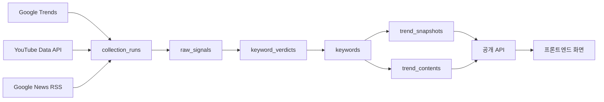

# TrendDrop 데이터 스키마 & API 명세

> 프론트엔드/데이터분석가 공유용 요약본입니다. 배경·근거·이슈 목록 등 상세 분석은
> [page-analysis-and-backend-design.md](page-analysis-and-backend-design.md)를 참고하세요.
> 이 문서는 **설계안(target spec)** 이며, 구현 상태는 마지막 "현재 vs 예정" 표에서 확인하세요.

---

## 1. 데이터 흐름 한눈에 보기



- 수집은 `pipeline` 단위(예: `master`, `v-he`)로 `collection_runs` 1건을 남기고, 그 실행에서 나온 원문은 `raw_signals`, 정제된 결과는 `keywords` + `trend_snapshots` + `trend_contents`에 쌓입니다.
- 프론트는 테이블을 직접 조회하지 않고 항상 2절의 공개 API를 통해서만 데이터를 받습니다.

---

## 2. 스키마 (데이터분석가용)

### 2.1 `categories` — 카테고리 마스터

| 컬럼         | 타입           | 설명                                                    |
| ------------ | -------------- | ------------------------------------------------------- |
| `id`         | int PK         |                                                         |
| `name`       | string, unique | 화면에 표시되는 카테고리명 (예: `푸드`, `뷰티`, `테크`) |
| `slug`       | string, unique | URL/쿼리 파라미터용 식별자                              |
| `sort_order` | int            | 카테고리 탭·히트맵 행 표시 순서                         |

### 2.2 `sources` — 수집 소스 마스터

| 컬럼   | 타입           | 설명                                                            |
| ------ | -------------- | --------------------------------------------------------------- |
| `id`   | int PK         |                                                                 |
| `name` | string, unique | 예: `Google Trends`, `YouTube Data API`, `Google News RSS`      |
| `kind` | string         | 소스 종류 코드 (`google-trends` / `youtube` / `google-news` 등) |

### 2.3 `collection_runs` — 수집 실행 로그

| 컬럼                         | 타입      | 설명                                                                                  |
| ---------------------------- | --------- | ------------------------------------------------------------------------------------- |
| `id`                         | int PK    | **이 값이 "시점(snapshot)" 의 기준**입니다 — 시계열 조회 시 항상 `run_id` 순서로 정렬 |
| `pipeline`                   | string    | 어떤 수집 파이프라인이 실행됐는지 (`master` / `v-he` 등)                              |
| `geo`                        | string    | 국가 코드 (기본 `KR`)                                                                 |
| `started_at` / `finished_at` | timestamp | 실행 시작/종료 시각. `finished_at`이 null이면 아직 실행 중                            |
| `status`                     | string    | `running` / `success` / `failed`                                                      |
| `raw_signal_count`           | int       | 이 실행에서 수집된 원문 신호 개수                                                     |
| `keyword_count`              | int       | 이 실행에서 확정된 키워드 개수                                                        |
| `api_call_log`               | jsonb     | `[{ api: string, calledAt: ISO string }]` — 외부 API 호출 이력                        |
| `error_message`              | text      | 실패 시 에러 메시지                                                                   |
| `bucket_at`                  | timestamp | 이 실행이 참조한 데이터의 기준 시각(창의 최신 버킷). `started_at`(프로세스 시작 시각)과 별개 — 수집이 늦어도 직전 데이터로 랭킹은 내되, 얼마나 오래된 데이터인지 판단하는 값 |
| `window_hours`               | int       | 집계 창 길이(시간). 실행마다 파라미터가 달라질 수 있어 재현성 확보용                  |
| `buckets`                    | int       | 창 안에 실제로 존재한 버킷 수. `window_hours`와 비교해 수집 누락을 감지                |
| `filtered`                   | boolean   | LLM 노이즈 필터가 이 실행에 실제로 적용됐는지(키 부재·오류 시 false로 남음)           |

### 2.4 `keywords` — 키워드(토픽) 엔티티

| 컬럼            | 타입            | 설명                                   |
| --------------- | --------------- | -------------------------------------- |
| `id`            | int PK          |                                        |
| `term`          | string, unique  | 키워드 원문 (예: `제로슈가 아이스티`)  |
| `slug`          | string, unique  | 상세 페이지 라우팅용 (`/trend/[slug]`) |
| `category_id`   | FK → categories |                                        |
| `source_id`     | FK → sources    | 최초 발견된 소스                       |
| `first_seen_at` | timestamp       | 최초 발견 시각                         |

### 2.5 `raw_signals` — 원문 신호 (정제 이전)

| 컬럼          | 타입                 | 설명                                                           |
| ------------- | -------------------- | -------------------------------------------------------------- |
| `id`          | bigint PK            |                                                                |
| `run_id`      | FK → collection_runs |                                                                |
| `source_id`   | FK → sources          | 어느 사이트/API에서 수집됐는지(예: `dcbest`/`youtube`/`gtrends`). 커뮤니티 소스가 늘어나면 `source` 문자열만으로는 사이트를 구분할 수 없어 별도 FK로 분리 |
| `source`      | string               | `trending_search` / `video_title` / `video_tag` / `comment` 등 — 신호의 종류(위 `source_id`와는 별개) |
| `text`        | text                 | 원문 텍스트                                                    |
| `text_hash`   | string               | 동일 실행 내 중복 제거용 해시                                  |
| `video_id`    | string, nullable     | YouTube 영상 ID(해당 시)                                       |
| `meta`        | jsonb                | 카테고리 힌트 등 부가 정보                                     |
| `bucket_at`   | timestamp             | 수집이 귀속되는 1시간 버킷(정시로 내림). `UNIQUE(source_id, text_hash, bucket_at)` 중복 제거와 체류시간 기반 가중치 계산에 사용 |
| `captured_at` | timestamp            | 실제 수집 시각                                                 |

> 데이터분석가 참고: 키워드가 왜 그 점수를 받았는지 원인 분석이 필요하면 이 테이블을 `run_id` + 토큰 매칭으로 역추적하면 됩니다.

### 2.6 `trend_snapshots` — 키워드별 시계열 스냅샷 ⭐ 가장 중요한 테이블

| 컬럼           | 타입                 | 설명                                                                                  |
| -------------- | -------------------- | ------------------------------------------------------------------------------------- |
| `id`           | bigint PK            |                                                                                       |
| `keyword_id`   | FK → keywords        |                                                                                       |
| `run_id`       | FK → collection_runs | 이 스냅샷이 속한 실행(=시점)                                                          |
| `rank`         | int                  | 해당 run 안에서의 순위(1이 1위)                                                       |
| `score`        | int (0~100)          | 트렌드 점수. 랭킹·정렬의 기준값                                                       |
| `growth_rate`  | string               | 표시용 문자열 (예: `+182%`, `1,200회 언급`) — 사람이 읽는 라벨이지 계산용 수치가 아님 |
| `velocity`     | string               | 확산 속도 표시값 (예: `9.1/10`)                                                       |
| `mentions`     | int                  | 창(window) 안 언급 횟수(raw count) — `growth_rate` 같은 표시값의 근거 원본            |
| `summary`      | text                 | 1줄 요약                                                                              |
| `reasons`      | jsonb                | `[{ source: string, text: string, sample?: string, weight?: number }]` — "왜 뜨나" 근거 목록. `sample`은 근거가 된 원문 인용, `weight`는 해당 소스가 점수에 기여한 비중 |
| `source_label` | string               | 사람이 읽는 출처 설명 (예: `Google Trends + YouTube 교차확인`)                        |
| `external_ref` | string               | 외부 소스 참조 키                                                                     |
| `source_url`   | text                 | 대표 원문 링크                                                                        |
| `captured_at`  | timestamp            | 실제 수집 시각 (`run.started_at`과 별개로 있을 수 있음)                               |

> **`score` vs `rank` 구분**: `rank`는 해당 시점(run) 안에서의 상대 순위, `score`는 절대 점수입니다. 시계열 차트는 `score`를, 등락 배지(▲▼NEW)는 이전 run 대비 `rank` 변화를 씁니다.
>
> **단일 `source_id` 컬럼을 두지 않는 이유**: 한 키워드가 같은 시점에 여러 소스(Google Trends + YouTube 등)에서 동시에 잡히는 게 정상이라 "대표 소스 하나"를 FK로 고를 기준이 없습니다. 소스별 기여는 `reasons`(배열)와 `source_label`(사람이 읽는 요약 문자열)이 이미 표현하므로, 단일 FK는 오히려 정보를 잃습니다.

### 2.7 `trend_contents` — 키워드에 딸린 콘텐츠(뉴스/영상 등)

| 컬럼            | 타입                | 설명                                             |
| --------------- | ------------------- | ------------------------------------------------ |
| `id`            | bigint PK           |                                                  |
| `keyword_id`    | FK → keywords       |                                                  |
| `kind`          | string              | `news` / `youtube` / `instagram` 등              |
| `title`         | text                |                                                  |
| `url`           | text                |                                                  |
| `thumbnail_url` | text, nullable      |                                                  |
| `metric_label`  | string, nullable    | 참여 지표 표시값 (예: `저장 12.4K`, `조회 84만`) |
| `source`        | string              | 채널/매체명                                      |
| `rank`          | int, nullable       | 콘텐츠 내 순위(영상 인기순 등)                   |
| `published_at`  | timestamp, nullable |                                                  |

### 2.8 `keyword_relations` — 연관 키워드

| 컬럼                 | 타입          | 설명                                                |
| -------------------- | ------------- | --------------------------------------------------- |
| `keyword_id`         | FK → keywords |                                                     |
| `related_keyword_id` | FK → keywords |                                                     |
| `weight`             | float         | 연관도 점수(co-occurrence 기반), 높을수록 강한 연관 |

### 2.9 `users` / `watchlist_items` — 워치리스트(향후)

| 테이블            | 컬럼                                      | 설명                           |
| ----------------- | ----------------------------------------- | ------------------------------ |
| `users`           | `id`, `email`, `password_hash`, `name`, `email_verified_at`, `created_at`, `updated_at` | 초기엔 익명 세션으로 대체 가능. `password_hash`는 해시된 값만 저장(평문 금지), 소셜 로그인 등을 열어두기 위해 nullable |
| `watchlist_items` | `id`, `user_id`, `keyword_id`, `added_at` | 사용자가 저장한 키워드         |

> 지금 프론트엔 저장 UI가 두 갈래로 따로 존재합니다 — 홈 "워치리스트 패널"(`watchItems` mock 배열)과 랭킹 행의 "관심 키워드 즐겨찾기 ★"(`localStorage`의 `td-saved-keywords`). 둘 다 이 `watchlist_items` 하나로 귀결되어야 할 같은 개념이라, 로그인이 붙기 전까지는 즐겨찾기를 `localStorage`에 남겨두는 게 맞지만 **API/화면을 합칠 때 두 UI를 하나의 저장 목록으로 통합**해야 합니다(중복 관리 UI를 남기지 않도록).

### 2.10 `keyword_verdicts` — 키워드 채택 판정 캐시

원문에서 뽑힌 단어를 그대로 `keywords`로 만들면 토큰화 손상(`오디세`→`오디세이`)이나 노이즈(`같아서`, `대한` 등 문법 조각)가 섞입니다. LLM이 이를 판정하고, 그 결과를 term 단위로 캐싱해두는 테이블입니다. **채택(`keep = true`)된 term만 `keywords`로 승격됩니다.**

| 컬럼           | 타입              | 설명                                                                 |
| -------------- | ----------------- | --------------------------------------------------------------------- |
| `term`         | text PK           | 판정 대상 원시 단어(토크나이저 산출물, 정규화 전)                     |
| `keep`         | boolean           | 트렌드 키워드로 채택할지                                              |
| `canonical`    | text, nullable    | 병합·복원된 정식 이름. 채택되면 이 값(없으면 `term` 그대로)이 `keywords.term`으로 연결됨 |
| `content_type` | text, nullable    | 인물 / 작품·콘텐츠 / 기업·주식 / 사건·사고 / 재난·속보 / 정치·사회 / 스포츠 / 일반어 / 문법조각 — `categories`(UI 탭용: 푸드/뷰티/테크)와는 다른 축이므로 별도 필드 |
| `reason`       | text              | 판정 이유 한 줄                                                       |
| `sample`       | text              | 판정 근거가 된 예문                                                   |
| `model`        | text              | 판정한 모델                                                           |
| `decided_at`   | timestamp         | 판정 시각(캐시 신선도 판단 기준)                                      |

> 같은 term을 두 번 LLM에 묻지 않기 위한 캐시입니다. 판정이 틀렸을 때는 해당 행을 지우거나 `keep`을 직접 고치면 다음 실행부터 재판정됩니다.

---

## 3. API 명세 (프론트엔드용)

모든 응답은 `{ data, meta }` 형태를 기본으로 합니다. `meta.updatedAt`은 응답에 포함된 데이터의 최신 갱신 시각입니다.

### 3.1 `GET /api/categories`

```json
{
  "data": [
    { "name": "전체", "slug": "all", "sortOrder": 0 },
    { "name": "푸드", "slug": "food", "sortOrder": 1 },
    { "name": "뷰티", "slug": "beauty", "sortOrder": 2 }
  ]
}
```

사용 화면: 홈 카테고리 탭, 탐색 히트맵 행 순서

### 3.2 `GET /api/trends?period=realtime|daily&category=&limit=30`

```json
{
  "data": [
    {
      "rank": 1,
      "keyword": "제로슈가 아이스티",
      "slug": "zero-sugar-ice-tea",
      "category": "푸드",
      "previousRank": 2,
      "growth": "+182%",
      "velocity": "9.1/10",
      "score": 88,
      "source": "Instagram Reels, Facebook Groups",
      "summary": "운동 루틴과 다이어트 브이로그에서 반복 노출...",
      "spark": [22, 26, 24, 41, 58, 74, 100]
    }
  ],
  "meta": {
    "period": "realtime",
    "runId": 482,
    "updatedAt": "2026-08-03T05:00:00Z",
    "ticker": [
      { "keyword": "두바이 초콜릿", "kind": "new", "delta": 0 },
      { "keyword": "저속노화 식단", "kind": "surge", "delta": 4 }
    ]
  }
}
```

`meta.ticker`는 이번 `runId`에서 새로 진입했거나(`kind: "new"`) 순위가 급등한(`kind: "surge"`, `delta`만큼) 키워드 목록입니다. 홈 상단 실시간 하이라이트 배너에 씀.

사용 화면: 홈 `RankingBoard` (기존 `TrendItem` 타입과 동일한 필드 구성 + `slug` 추가)

### 3.3 `GET /api/keywords/:slug`

```json
{
  "data": {
    "rank": 1,
    "keyword": "제로슈가 아이스티",
    "category": "푸드",
    "growth": "+182%",
    "velocity": "9.1/10",
    "score": 88,
    "detectedAgo": "2시간 전",
    "updatedAgo": "2시간 전",
    "summary": "운동 루틴과 다이어트 브이로그에서 반복 노출되며...",
    "reasons": [
      {
        "source": "Instagram Reels",
        "text": "\"10초 홈카페\" 포맷 레시피 릴스가 저장 수 상위권에 반복 진입"
      }
    ],
    "series": [22, 26, 24, 41, 58, 74, 100],
    "days": ["월", "화", "수", "목", "금", "토", "일"],
    "related": [
      {
        "platform": "Instagram",
        "title": "제로슈가 홈카페 3종 레시피",
        "metric": "저장 12.4K",
        "kind": "릴스",
        "url": "https://...",
        "thumbnailUrl": "https://..."
      }
    ],
    "keywords": ["#다이어트음료", "#홈카페", "#저칼로리"],
    "channels": ["Instagram Reels", "Facebook Groups", "YouTube Shorts"]
  }
}
```

사용 화면: `/trend/[slug]` 상세 페이지 (기존 `TrendDetail` 타입과 필드 동일, `related`에 `url`/`thumbnailUrl`만 추가)

없는 slug 요청 시: `404 { "error": "keyword not found" }`

### 3.4 `GET /api/keywords/:slug/history?window=12h`

```json
{
  "data": [
    { "runId": 471, "rank": 3, "score": 61 },
    { "runId": 472, "rank": null, "score": 0 },
    { "runId": 473, "rank": 2, "score": 74 }
  ]
}
```

`rank: null`은 해당 시점에 순위권 밖(이탈)을 의미. 사용 화면: `/trend` 스파크라인, `/explore` A/B 비교 차트

### 3.5 `GET /api/explore/heatmap?window=12h`

```json
{
  "data": {
    "columns": [
      {
        "runId": 471,
        "clock": "14:00",
        "label": "12시간 전",
        "isLatest": false
      },
      { "runId": 482, "clock": "지금", "label": "지금", "isLatest": true }
    ],
    "categories": ["푸드", "뷰티", "테크"],
    "matrix": [
      [40, 55, 100],
      [30, 42, 61],
      [20, 38, 45]
    ]
  }
}
```

`matrix[행][열]` = 해당 카테고리·시점의 heat(0~100). 사용 화면: `/explore` 히트맵 (기존 `ExploreView` props 구조와 동일)

### 3.6 워치리스트

| 엔드포인트                              | 설명               |
| --------------------------------------- | ------------------ |
| `GET /api/watchlist`                    | 저장한 키워드 목록 |
| `POST /api/watchlist` `{ keywordSlug }` | 추가               |
| `DELETE /api/watchlist/:id`             | 삭제               |

### 3.7 에러 응답 공통 포맷

```json
{ "error": "사람이 읽을 수 있는 메시지", "detail": "원인(선택)" }
```

HTTP 상태 코드: `400`(요청 오류) / `404`(대상 없음) / `401`(인증 실패, admin API만) / `500`(서버 오류)

### 3.8 관리자 API (참고용, 프론트에서 직접 호출하지 않음)

`POST /api/admin/collect/:pipeline` 로 수집 실행 — `Authorization: Bearer $CRON_SECRET` 필요. 상세는 메인 설계 문서 7.2절 참고.

---

## 4. 용어집

| 용어                       | 의미                                                               |
| -------------------------- | ------------------------------------------------------------------ |
| **run**                    | 한 번의 수집 실행. 시계열의 "시점" 단위. `collection_runs.id`      |
| **score**                  | 0~100 트렌드 점수(정렬·차트 기준값)                                |
| **rank**                   | 해당 run 안에서 score로 매긴 순위(1위부터)                         |
| **growth_rate / velocity** | 사람이 읽는 표시용 문자열. 계산에 쓰지 말고 그대로 렌더링만 할 것  |
| **previousRank**           | 직전 run 대비 순위. `null`이면 신규 진입(NEW)                      |
| **pipeline**               | 수집 로직 갈래 구분자(`master` / `v-he`). 데이터 출처 추적 시 사용 |
| **slug**                   | 키워드/카테고리의 URL 식별자. `term`(원문 한글)과 별개             |
| **ticker**                 | 홈 상단에 흐르는 신규/급상승 키워드 배너. `GET /api/trends`의 `meta.ticker`로 내려옴 |

---

## 5. 실시간 갱신 가이드 (프론트엔드용)

홈 LIVE 모드는 서버 푸시가 아니라 **주기적 재조회(폴링)** 로 구현하는 것을 권장합니다.

- LIVE가 켜져 있으면 `GET /api/trends`를 15~30초 간격으로 재요청
- 응답의 `meta.runId`가 직전과 같으면 그대로 두고(아직 새 수집이 안 돈 것), 바뀌었을 때만 리스트·`meta.ticker`를 갱신
- 관리자가 수집을 실행한 직후에는 별도로 즉시 1회 재조회해서 반영 지연이 없게 할 것(현재 프론트가 하는 `window.location.reload()`는 mock 데이터라 의미 없는 새로고침이므로, 실 API 연동 시 이 로직으로 교체 필요)
- 수집 주기가 짧아지면(예: 5분 이하) 폴링 대신 SSE/웹소켓 전환을 고려하되, 지금 단계에서는 폴링으로 충분

---

## 6. 현재 구현 상태 (중요)

| 항목                                                                                                                          | 상태                                                                                                         |
| ----------------------------------------------------------------------------------------------------------------------------- | ------------------------------------------------------------------------------------------------------------ |
| `db/schema.ts` (master), `lib/pipeline-v-he/schema.ts` (v-he)                                                                 | ✅ 구현됨(단, 이 문서의 통합 스키마와 컬럼명·구조가 다름 — 아직 마이그레이션 전)                             |
| 2절 스키마의 `categories`, `keyword_relations`, `users`, `watchlist_items`, `reasons`(jsonb), `thumbnail_url`, `metric_label` | ❌ 미구현 — 설계 단계                                                                                        |
| `collection_runs.bucket_at`/`window_hours`/`buckets`/`filtered`, `raw_signals.source_id`/`bucket_at`, `trend_snapshots.mentions`, `keyword_verdicts` | ⚠️ `trend-rising/` 파이프라인(별도 DB 테이블: `popular_runs`/`rising_raw_items`/`popular_snapshots`/`popular_term_verdicts`)에는 이미 구현돼 있으나, 이 문서의 통합 스키마엔 아직 반영·마이그레이션 전 |
| `GET /api/trends`                                                                                                             | ✅ 구현됨(단, 응답 필드가 3.2 예시보다 적고 `slug`/`previousRank`/`spark` 없음)                              |
| 3.3~3.6의 API (`/api/keywords/:slug`, `/history`, `/explore/heatmap`, `/watchlist`)                                           | ❌ 미구현 — 홈/탐색/상세 화면은 현재 전부 mock 데이터(`lib/trend-data.ts`, `lib/trend-timeline.ts`)로만 동작 |
| `meta.ticker`, 5절의 폴링 가이드                                                                                              | ❌ 미구현 — 현재 티커는 `lib/trend-timeline.ts`의 `getTickerItems()` mock 계산, LIVE 토글은 8초 setInterval로 mock 스냅샷 인덱스만 증가시킴 |

프론트엔드는 이 문서를 **목표 API 계약(contract)** 으로 보고 작업하되, 실제 배포 전까지는 mock 데이터 기준으로 개발하고 있다는 점을 참고해 주세요.
