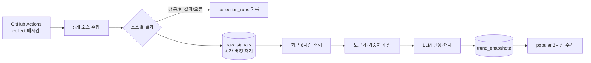
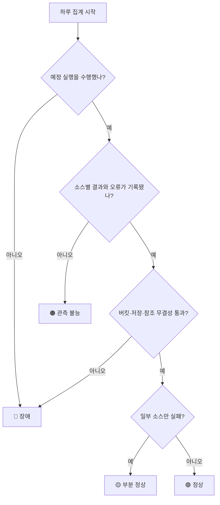

# 데이터 수집 파이프라인 평가 기준

> 이 문서는 키워드의 인기나 유효성이 아니라 `collect.mjs`부터 `trend_snapshots` 저장까지 파이프라인 자체의 정상성·신뢰성·관측성을 평가하기 위한 기준이다.

## 평가 범위

```text
GitHub Actions → collect.mjs → raw_signals
               → rank-popular.mjs → popular.mjs / verdict.mjs
               → trend_snapshots
```

현재 수집은 매시간, 랭킹은 2시간마다 실행된다. 따라서 평가는 최종 키워드가 마음에 드는지를 보는 것이 아니라 각 실행이 예정된 시간에 수행됐고, 소스 결과가 유실 없이 다음 단계로 전달됐는지를 확인해야 한다.

## 한눈에 보는 파이프라인 상태



### 현재 운영 스코어카드

| 평가 영역 | 현재 측정값 | 기준 | 상태 |
|---|---:|---:|:---:|
| 최근 24시간 버킷 | `6 / 6` | `≥ 99%` | ✅ |
| 최근 24시간 랭킹 | `5 / 5 성공` | `≥ 98%` | ✅ |
| 최근 24시간 수집 | `2 성공 / 4 partial` | partial 원인 확인 | ⚠️ |
| 최근 7일 수집 | `22 성공 / 44회` | 시간당 실행 기대 | ⚠️ |
| 최근 7일 랭킹 | `36 / 36 성공` | `≥ 98%` | ✅ |
| 전체 원문 보존 | `56,603건` | 증가량 추적 | ℹ️ |

```text
현재 종합 상태: ⚠️ 부분 정상

수집  ███████████░░░  partial 원인 확인 필요
랭킹  ███████████████  정상
버킷  ███████████████  최근 24시간 정상
```

이 스코어카드는 문서 작성 시점인 2026-09-09의 Neon 실측값이다. `partial`의 내부 원인이 아직 source별로 분해되지 않았으므로 수집 전체를 정상으로 판정하지 않는다.

## 현재 기준선 측정 결과

2026-09-09 현재 Neon 데이터를 기준으로 실제 집계한 결과는 다음과 같다.

| 범위 | 결과 | 1차 판정 |
|---|---:|---|
| 최근 24시간 원문 버킷 | 6개 / 기대 6개 | 통과 |
| 최근 24시간 raw_signals | 1,065건 | 참고 기준선 |
| 최근 24시간 collect | 성공 2, partial 4 | 경고 |
| 최근 24시간 popular | 성공 5, 실패 0 | 통과 |
| 최근 7일 collect | 44회 기록 | 예정 168회 대비 미달 가능성 |
| 최근 7일 collect | 성공 22회, partial 22회 | 부분 성공률 50% |
| 최근 7일 popular | 성공 36회, 실패 0회 | 통과 |
| 전체 raw_signals | 56,603건 / 290버킷 | 장기 보존 기준선 |

따라서 현재 파이프라인의 1차 판정은 `부분 정상`이다. 랭킹 단계와 최근 24시간 버킷은 정상적으로 보이지만, 수집 단계의 partial 비율이 높고 최근 7일 실행 기록이 시간당 스케줄 기대치와 일치하지 않는다. 이 문서의 기준을 적용하려면 먼저 partial의 소스별 원인과 실행 누락 여부를 분리해 확인해야 한다.

이 수치는 문서 작성 시점의 스냅샷이며, 아래 재현 절차로 다시 계산해야 한다.

```text
1. collection_runs에서 최근 7일 collect/popular 실행을 조회한다.
2. status별 개수와 시간 간격을 계산한다.
3. raw_signals에서 최근 24시간 distinct bucket_at을 계산한다.
4. collection_runs.api_call_log를 source별로 펼쳐 success/empty/error를 계산한다.
5. raw_signal_count와 실제 raw_signals 저장 건수를 비교한다.
```

## 핵심 지표

### 상태 판정 흐름



### 실행 완전성

```text
execution_success_rate
  = (success 또는 partial 실행 수 / 예정 실행 수) × 100

full_success_rate = success 실행 수 / 예정 실행 수 × 100
partial_rate      = partial 실행 수 / 예정 실행 수 × 100
error_rate        = error 실행 수 / 예정 실행 수 × 100
```

목표는 수집 99% 이상, 랭킹 98% 이상이다. `partial`은 전체 장애가 아니지만 완전 성공으로 숨기지 않고 별도로 기록한다.

### 소스 커버리지와 수집량

`collection_runs.api_call_log`의 `{source, items, error}`를 기준으로 소스별 성공과 수량을 계산한다.

```text
source_success_rate = 오류 없이 응답한 실행 수 / 예정 실행 수 × 100
source_coverage     = 실제 수집 소스 수 / 예정 소스 수 × 100
volume_ratio        = 이번 수집 건수 / 최근 7일 동일 시간대 중앙값
```

권장 기준은 소스 성공률 95% 이상, 전체 소스 커버리지 100%, `volume_ratio` 0.7~1.3이다. 평소 200건이 들어오던 소스가 0건이면 API 오류가 없어도 수집 이상으로 분류한다. YouTube 키 미설정처럼 “정상 실행이지만 비활성화된 상태”와 API 오류는 구분해 기록해야 한다.

### 시간 신선도와 버킷 누락

```text
bucket_completeness = 실제 버킷 수 / 기대 버킷 수 × 100
collection_lag      = captured_at - bucket_at
freshness_sla_rate  = collection_lag ≤ 15분인 실행 수 / 전체 실행 수 × 100
```

최근 24시간 버킷 완전성은 99% 이상, 15분 이내 수집 비율은 95% 이상을 목표로 한다. 랭킹 실행에서 `buckets < windowHours`이면 데이터 부족 상태로 남겨야 한다.

### 저장·중복·처리 정합성

```text
persist_rate = DB 신규 raw_signals 수 / 어댑터 반환 행 수 × 100
duplicate_rate = 중복으로 무시된 행 수 / 어댑터 반환 행 수 × 100
snapshot_completeness = 저장 snapshot 수 / 목표 TOP_N × 100
snapshot_link_rate = 유효한 keyword_id·run_id snapshot 수 / 전체 snapshot 수 × 100
```

`persist_rate`는 100%에 가깝고 snapshot 완전성·참조 무결성은 100%가 목표다. 같은 `source_id`, `text_hash`, `bucket_at` 중복은 제거해야 하지만, 버킷이 다른 동일 원문은 체류시간 신호이므로 보존해야 한다.

### 재현성과 장애 관측성

```text
ranking_reproducibility
  = 동일 입력·동일 설정에서 동일한 순위 수 / 전체 순위 수 × 100

diagnosable_run_rate
  = 상태·오류·소스별 수량이 모두 기록된 실행 수 / 전체 실행 수 × 100

silent_failure_rate
  = 성공 처리됐지만 기대량 미달을 기록하지 못한 실행 수 / 전체 실행 수 × 100
```

재현성·진단 가능 실행률은 100%, 조용한 실패율은 0%가 목표다. 특히 소스 0건, 평소 대비 30% 미만 급감, 6시간 창의 버킷 부족, LLM fallback, 수집 반환량과 DB 저장량 불일치는 반드시 상태로 남겨야 한다.

## 하루 단위 운영 판정

```text
정상
  = full_success_rate ≥ 99%
  AND 소스 성공률 ≥ 95%
  AND bucket_completeness ≥ 99%
  AND freshness_sla_rate ≥ 95%
  AND persist_rate ≥ 99%
  AND snapshot_link_rate = 100%
  AND silent_failure_rate = 0%
```

한 소스만 실패하고 나머지 조건을 만족하면 `부분 정상`, 버킷 누락이나 DB 저장 실패가 있으면 `장애`, 실행은 성공했지만 기대량 급감이나 LLM fallback을 기록하지 못하면 `관측 불능`으로 분류한다.

## 비용과 보존성

```text
llm_cache_hit_rate = 캐시 판정 수 / 전체 후보 수 × 100
storage_growth_rate = 최근 7일 raw_signals 증가량 / 7
```

LLM 캐시 적중률은 기준선을 만든 뒤 20%p 이상 급락하면 후보 생성이나 캐시 키 변경을 조사한다. `raw_signals`는 계속 증가하므로 주간 증가량과 저장 한도 도달 예상일도 함께 확인한다.

## 반영 순서

1. `collection_runs`와 `raw_signals`를 집계하는 read-only 점검 스크립트를 만든다.
2. 최근 24시간·7일의 실행률, 버킷 완전성, 소스별 수집량, 저장률을 매일 출력한다.
3. `api_call_log`를 source별로 펼쳐 partial 원인을 `empty`, `error`, `disabled`로 구분한다.
4. `duration_ms`, `expected_sources`, `source_volume_ratio`, `freshness_status`, `persisted_count`, `error_class`를 실행 로그에 추가한다.
5. 기준 미달이면 GitHub Actions가 실패하거나 알림을 남기도록 연결한다.

현재 `collection_runs`의 `status`, `raw_signal_count`, `keyword_count`, `api_call_log`, `buckets`, `filtered`만으로도 1~3단계의 기본 리포트를 만들 수 있다. 이후 컬럼을 추가하면 위 지표를 실행 시점에 자동화할 수 있다.

이 기준은 키워드의 내용 품질을 판정하지 않는다. 파이프라인이 신뢰할 수 있는 원문을 제시간에 빠짐없이 저장하고, 같은 입력에서 같은 결과를 재현하는지를 평가하는 데 목적이 있다.
